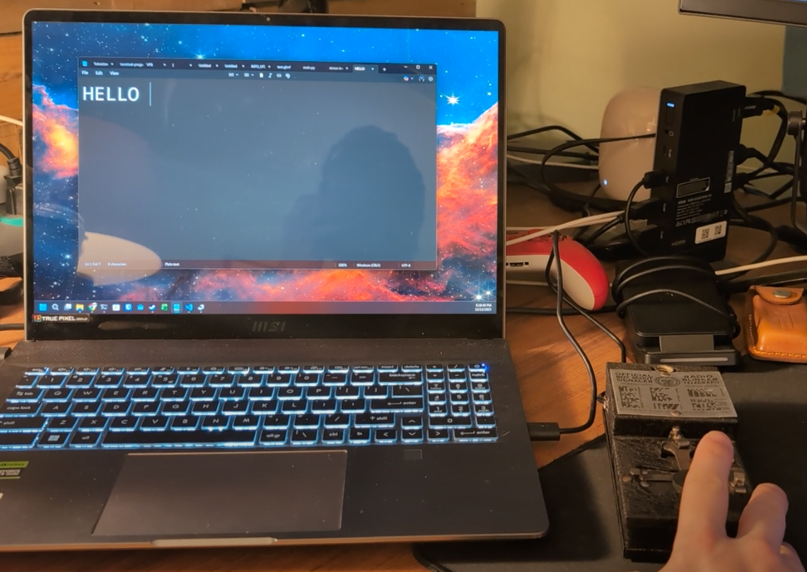
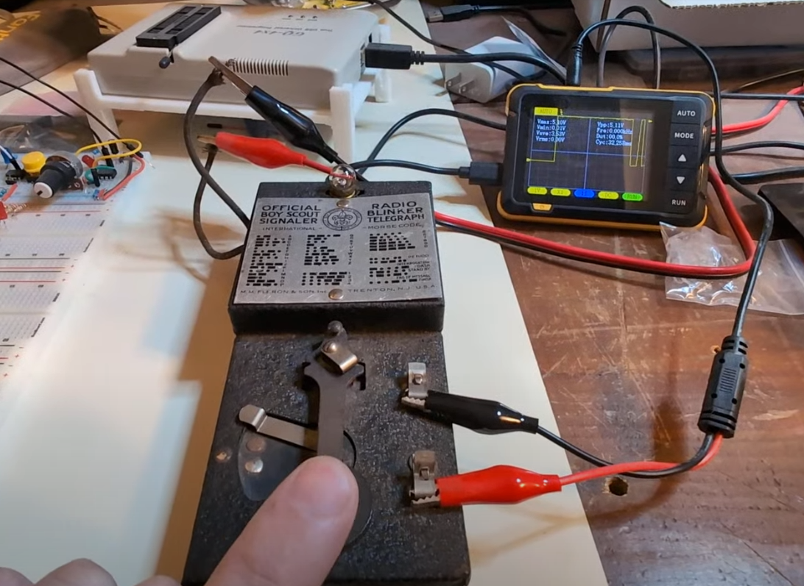
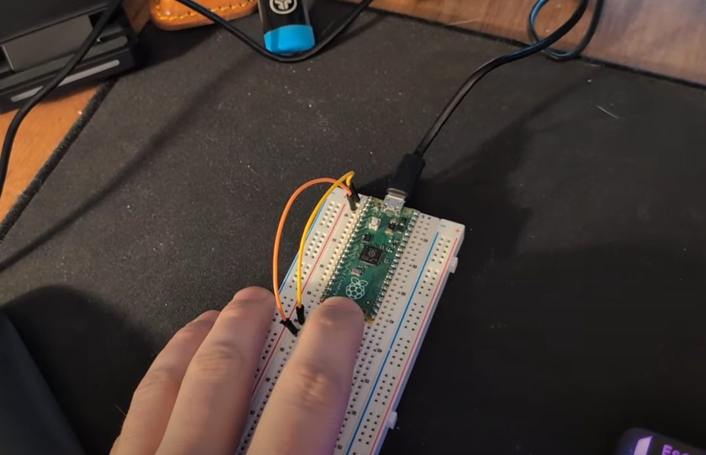
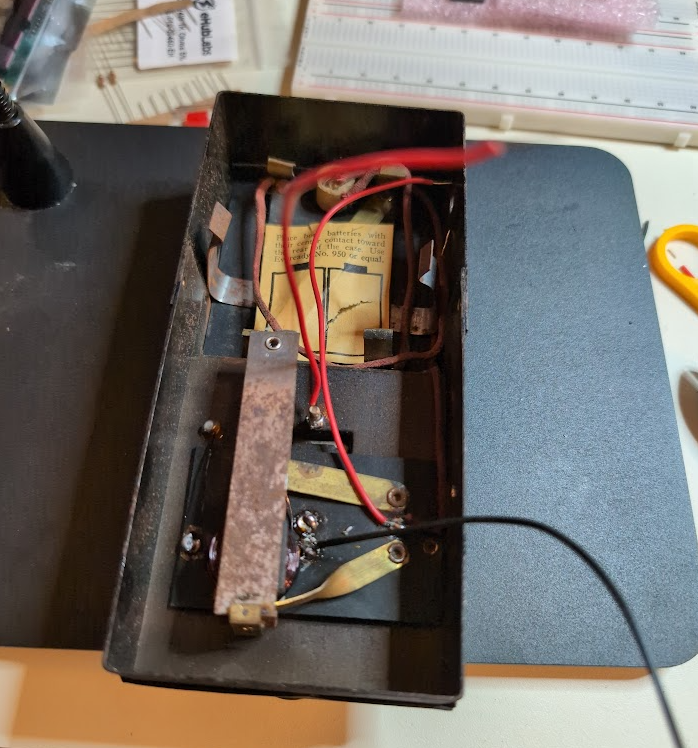
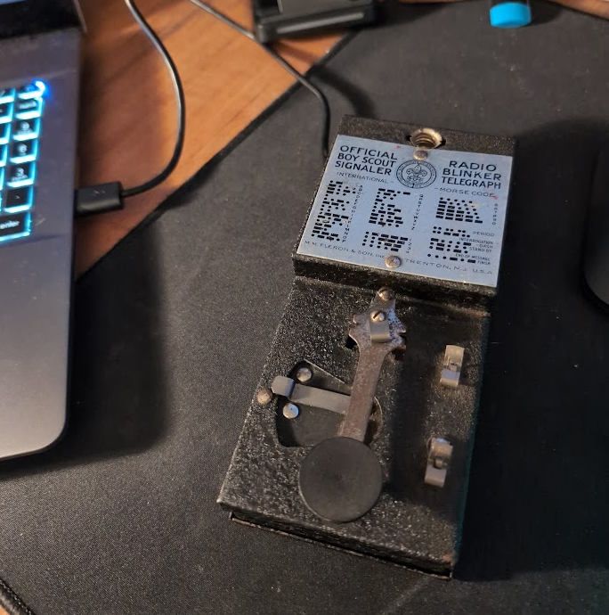

# telegraph-hid

Circuitpython code for a Raspberry Pi Pico to act as a Human Interface Device for a telegraph transmitter.

# Input / Output

Pulses on GPIO pins 0, 1, and 2 will be interpreted as Morse Code according to their duration. GPIO 3 will be turned on in time with the pressing of the telegraph key to illuminate an incandescent light with the use of a MOSFET transistor acting as a digital switch.

GPIO 0 will convert morse code to UPPER case ASCII characters.

GPIO 1 will convert morse code to lower case ASCII characters.

GPIO 2 will output unconverted morse code dots (.) and dashes (-).

# Morse Code Terminology

Morse Code uses the following terminology:
- DIT (one unit of time)
  - This is 250 milliseconds in this implementation
- DAH (three units of time)
  - Being three DITs, this is 750 milliseconds in this implementation

A dot (.) in Morse Code lasts for one DIT

A dash (-) in Morse Code lasts for one DAH

A pause of one DAH indicates a break between letters

A pause of seven DITs indicates a break between words

